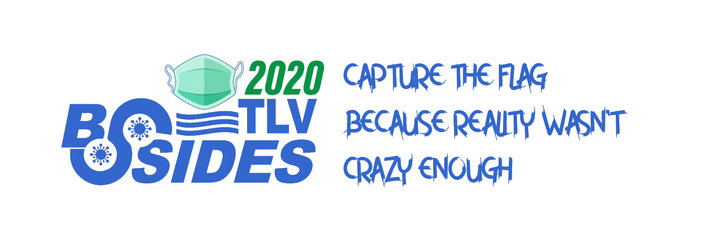

# BSidesTLV 2020 Public Repository

## Contact Us

You can contact us through our [Slack channel](https://join.slack.com/t/bsidestlv/shared_invite/zt-ezz7de5w-zKO_PyubEBs2_UDIssDw8A), or follow us on social media: [@BSidesTLV_CTF](https://twitter.com/BSidesTLV_CTF)

More information is available on the [BSidesTLV website](https://bsidestlv.com)

## Layout

Our challenges are written in many languages and with many dependencies, naturally wrapping them in containers seems simplest.
You can find our Dockerfiles in the `dockerfiles` folder, seprated into different challenges.

## Writing and Support Team

* Reut Menashe
* Tomer Zait
* Roei Sherman
* Nimrod Levy
* Vera Mens
* Yahav
* Daniel Abeles
* Guy Barnhart-Magen
* Lavie BB
* Guy Beck
* Artur Isakhanyan
* Michael Maltsev
* Omer Cohen

## License

[MIT License](LICENSE)